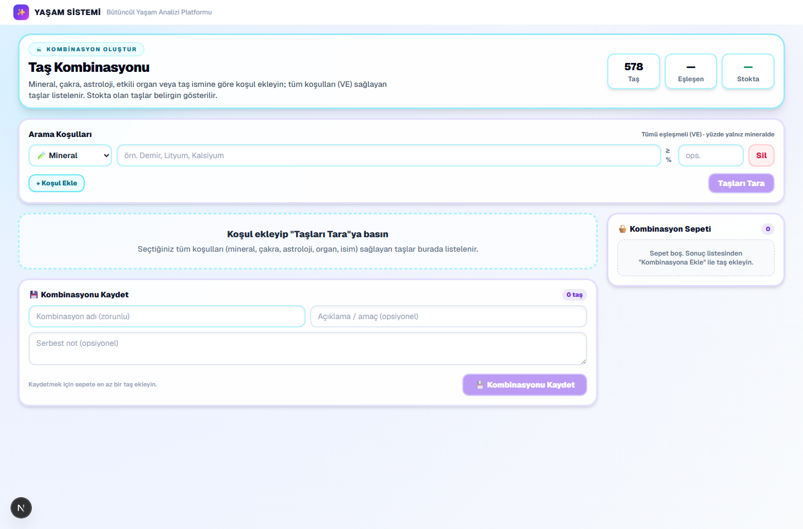
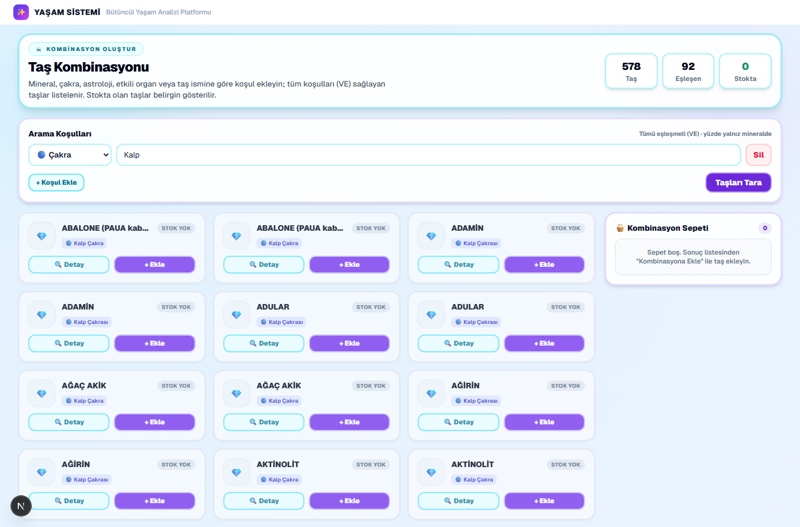
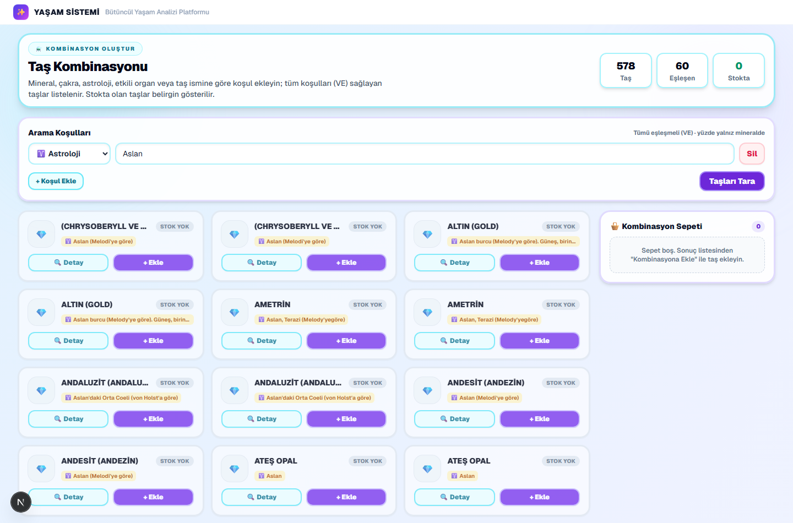
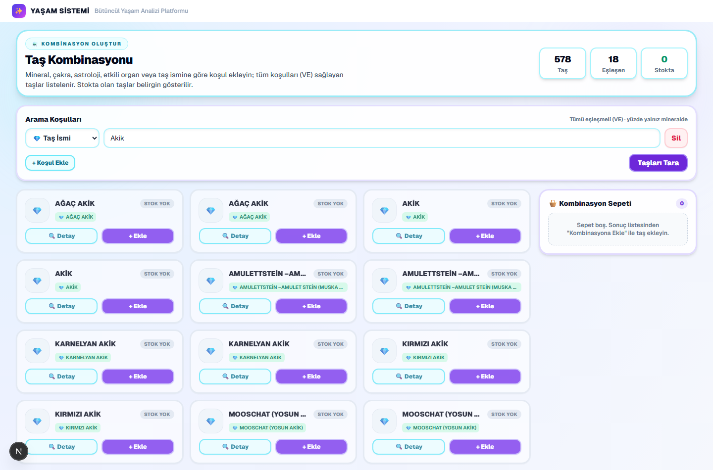
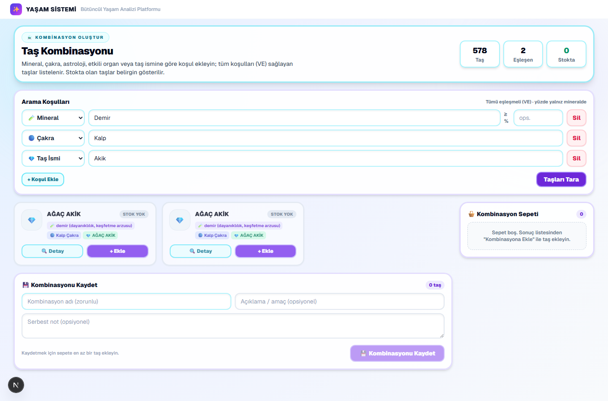
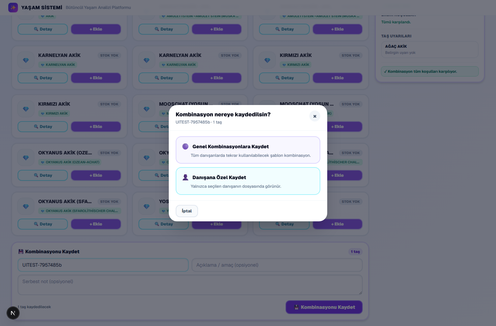
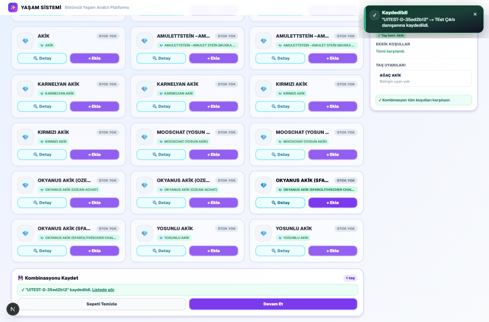
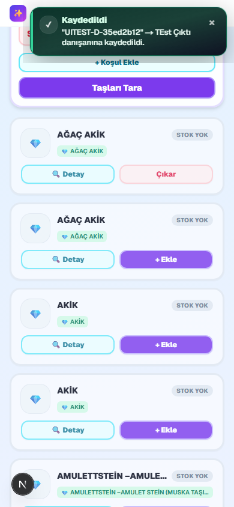

# Doğrulama: Doğaltaş Kombinasyon Oluştur — Çok Türlü Arama

**Özellik:** "Kombinasyon Oluştur" sayfasında (`/dogaltas/kombinasyon-olustur`) çok türlü
arama koşulu — **Mineral, Çakra, Astroloji, Etkili Organ, Taş İsmi** — VE (AND)
mantığıyla; genel ve danışana özel kombinasyon kaydı.

- **Commit:** `4ff859a` (`feat(dogaltas): multi-type search in combination builder`)
- **Test tarihi:** 2026-06-26
- **Ortam:** Gerçek tarayıcı (Chromium/Playwright) + gerçek uzman oturumu + gerçek danışan, 678 taş yüklü.

## Özet: 18/18 PASS

Tüm görsel, fonksiyonel ve veri katmanı testleri başarılı.

### Veri / API testleri
- ✅ **Genel kombinasyona kayıt** — `POST /api/dogaltas/combinations/save`, DB'de doğrulandı; `notes_text` çok-türlü koşul özetini içeriyor.
- ✅ **Danışana özel kayıt** — `POST /api/clients/[id]/combinations`, DB'de doğrulandı.
- ✅ **RLS** — `client_combinations` tablosunda anon SELECT/INSERT/UPDATE/DELETE engelli (service_role-only).
- ✅ **Tenant izolasyonu / IDOR** — başka tenant kullanıcısı bir danışanın kombinasyonlarına erişemiyor (GET/POST → 403).
- ✅ FK (`client_id → clients.id` ON DELETE CASCADE), `updated_at` trigger, insert→select→update→delete döngüsü.

### Görsel testler
| Ekran görüntüsü | Kapsam |
|---|---|
| [`desktop-initial.png`](desktop-initial.png) | Açılış — "Arama Koşulları", tür select (🧪 Mineral · 🔵 Çakra · ♈ Astroloji · 🫀 Etkili Organ · 💎 Taş İsmi) |
| [`chakra-search.png`](chakra-search.png) | Çakra araması (Kalp) → 92 sonuç; mineral dışı türde yüzde alanı gizli; "🔵 Kalp Çakra" eşleşme etiketleri |
| [`astrology-search.png`](astrology-search.png) | Astroloji araması (Aslan) → 60 sonuç |
| [`stone-name-search.png`](stone-name-search.png) | Taş ismi kısmi araması (Akik) → 18 sonuç |
| [`multitype-and-results.png`](multitype-and-results.png) | Çoklu koşul VE (Mineral: Demir + Çakra: Kalp + Taş İsmi: Akik) |
| [`save-modal.png`](save-modal.png) | Kaydet hedef seçim modalı — "Kombinasyon nereye kaydedilsin?" (Genel / Danışana Özel) |
| [`client-save-toast.png`](client-save-toast.png) | Danışana özel kayıt onayı (toast: "… danışanına kaydedildi") |
| [`mobile-responsive.png`](mobile-responsive.png) | Mobil (390px) — tek sütun, yatay taşma yok, select/input/Sil düzgün |

## Ekran Görüntüleri

### 1. Açılış (Desktop)

### 2. Çakra araması (Kalp)

### 3. Astroloji araması (Aslan)

### 4. Taş ismi kısmi araması (Akik)

### 5. Çoklu koşul VE

### 6. Kaydet hedef seçim modalı

### 7. Danışana özel kayıt onayı

### 8. Mobil responsive (390px)

### Doğrulanan maddeler (18/18)
1. Tür select + 5 seçenek · 2. Seçenekler tam · 3. Mineral'de yüzde görünür ·
4. Mineral dışı türde yüzde gizli · 5. Autocomplete tür değişince güncelleniyor ·
6. Çakra araması · 7. Astroloji araması · 8. Etkili organ araması ·
9. Taş ismi kısmi eşleşme · 10. Çoklu koşul VE · 11. Sonuç kartı eşleşme etiketleri ·
12. Stok belirgin gösterim · 13. Sepete ekleme · 14. Kaydet modalı ·
15. Genel kombinasyona kaydet · 16. Danışana özel kaydet ·
17. Desktop yatay taşma yok · 18. Mobil responsive (select/input/Sil).

## Not
Tüm test verileri (geçici `user_sessions` token'ları, oluşturulan genel + danışan
kombinasyonları) test sonunda **otomatik temizlendi**; canlı/gerçek veri etkilenmedi.
